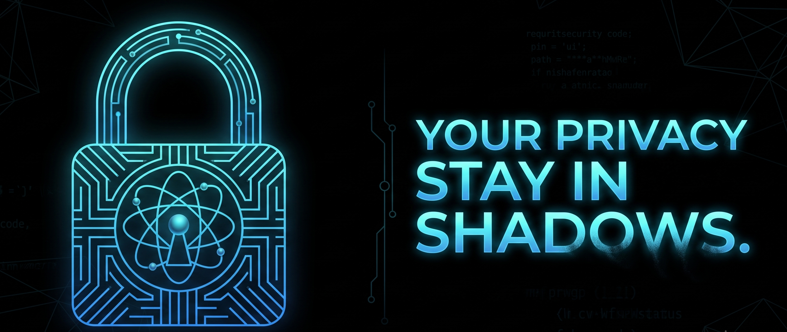
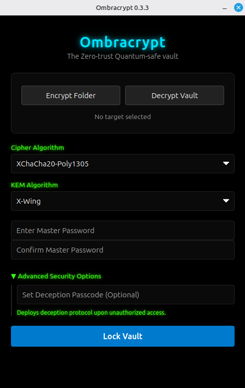

<p align="center">
  
</p>

<h1 align="center">Ombracrypt</h1>

<p align="center">
  <strong>The zero-trust quantum vault for cross-platform data sovereignty.</strong>
</p>

<p align="center">
  
  
</p>

### Overview & Features

Ombracrypt is an network-isolated, cross-platform Post-Quantum Cryptographic (PQC) tool focused on securing digital data. It is specifically designed to defend against future quantum computing-based cyberattacks, ensuring absolute data privacy without relying on external infrastructure or cloud services. The application combines a simple, easy-to-use interface with high-performance cryptographic execution.

<p align="center">
  
</p>

* **Cross-Platform:** Native installers generated via automated CI/CD for Linux, Windows, and macOS.
* **Network-isolated Execution:** No telemetry, no cloud accounts, and no internet connection required.
* **Modern Cryptography:** Utilizes NIST-standard file encryption algorithms validated through CAVP and CMVP.
* **Hybrid KEM Architecture:** Employs a hybrid Key Encapsulation Mechanism (KEM) that combines traditional cryptography with Post-Quantum Cryptography (PQC) to provide enhanced encryption.


## Security & Threat Model
Transparency is paramount in cryptographic tooling. Ombracrypt is strictly designed to secure data at rest against modern and future threats, but it operates under the assumption that the host environment itself is secure.

**In Scope:**
*   **Post-Quantum Resilience:** Protecting Ombracrypt Vaults (`.obv`) stored on untrusted public clouds or shared media against "Store Now, Decrypt Later" (SNDL) attacks utilizing quantum computing.
*   **Cryptographic Agility:** Offering a modular selection of symmetric ciphers and Key Encapsulation Mechanisms (KEMs), empowering users to calibrate the trade-off between cryptographic strength and processing overhead.
*   **Secure Bundling:** Consolidating multiple heterogeneous files into a single encrypted `.obv` vault for streamlined, organized data management.
*   **Physical & Local Security:** Mitigating unauthorized local access and protecting payloads against the physical theft of offline storage devices.
*   **Supply Chain Integrity:** Ensuring transparent, verifiable release binaries through automated GitHub Actions CI/CD pipelines.
* **Anti-Coercion (Panic Passphrase):** Mitigating physical duress (rubber-hose cryptanalysis) by allowing users to input a specialized password that instantly and securely erases the Ombracrypt Key (`.obk`) file, rendering the vault permanently inaccessible.

**Out of Scope:**
*   **Endpoint Compromise:** Defending against active keyloggers, memory scraping, screen-recording malware, or inherently compromised host operating systems.
*   **Data Recovery:** Retrieving encrypted payloads if the master passphrase is forgotten or the Ombracrypt Key (`.obk`) file is permanently lost. Our zero-knowledge architecture means there are absolutely no backdoors.

## Operational Limitations (v0.2.3)

* **RAM-Bound Cryptography:** In the current build, the core engine loads and processes entire archives directly in memory. Disk-streaming for chunked encryption is not yet implemented.
* **Maximum Payload Limit:** The size of the directory or file being encrypted must be strictly less than your system's available free RAM. Exceeding this limit will result in Out-of-Memory (OOM) exceptions and process termination.

## Installation & Usage

Download the latest stable release from our [Releases Page](https://github.com/ABiswasDev/Ombracrypt/releases).

* **Linux (Debian-based distributions):** Download and install the `.deb` package.
* **Linux (Red Hat-based distributions):** Download and install the `.rpm` package.
* **Windows:** Download and run the `.exe` or `.msi` setup file.
* **macOS:** Mount the `.dmg` image or extract the `.app.tar.gz` archive.

To secure your data, first organize your target files into a single directory. Launch Ombracrypt, select this directory via the interface, choose your preferred cryptographic algorithms, and set a strong passphrase. The engine will process the folder and output a Quantum-Safe Vault (`.obv`) and a corresponding Ombracrypt Key (`.obk`). 

To restore your files, select your `.obv` vault and `.obk` key file, input your master passphrase, and initiate the decryption process. 

For detailed, visual step-by-step instructions for users, please read our official [Quickstart Guide](docs/QUICKSTART.md).

## Best Practices
* **Passphrase Management:**Either completely memorize your master passphrase, or store it in a secure, offline password manager. Never store passphrases in plain text.
* **Separation of Assets:** Always store your Ombracrypt Key (`.obk`) in a physically and logically separate location from your encrypted Ombracrypt Vault (`.obv`) to prevent a single-point-of-failure compromise.
* **Data Verification:** Verify that the encryption process completed successfully and that you can decrypt the vault before permanently deleting or wiping the original, unencrypted source files.

## Developer Guide: Building from Source

Ombracrypt utilizes a Tauri architecture, bridging a lightweight web frontend with a high-performance Rust cryptographic core. If you wish to audit the code, contribute, or compile the application locally, follow these steps.

**1. Prerequisites**
Ensure your development environment has the following core tools installed:
*   [Git](https://git-scm.com/)
*   [Node.js](https://nodejs.org/) (v18 or higher)
*   [Rust & Cargo](https://rustup.rs/) (latest stable toolchain)

**Platform-Specific Dependencies:**
*   **Windows:** You must install the [Microsoft C++ Build Tools](https://visualstudio.microsoft.com/visual-cpp-build-tools/). During the installer setup, ensure the **"Desktop development with C++"** workload is selected. *(Note: Windows 10 users may also need to install the WebView2 runtime; it is pre-installed on Windows 11).*
*   **macOS:** You must install the Xcode Command Line Tools to compile the C and Rust dependencies. Open your terminal and run:
    ```bash
    xcode-select --install
    ```
*   **Linux (Debian/Ubuntu/Mint):** You must install the WebKit and GTK packages required by Tauri. Open your terminal and run:
    ```bash
    sudo apt update
    sudo apt install libwebkit2gtk-4.1-dev build-essential curl wget file libssl-dev libgtk-3-dev libayatana-appindicator3-dev librsvg2-dev
    ```

**2. Local Setup & Execution**
```bash
# Clone the repository
git clone [https://github.com/ABiswasDev/Ombracrypt.git](https://github.com/ABiswasDev/Ombracrypt.git)
cd Ombracrypt

# Install frontend dependencies
npm install

# Launch the application in development mode (with hot-reloading)
npm run tauri dev

**3. Building for Production**
To build the optimized release binaries for your current operating system, run:
`npm run tauri build`

The compiled installation files will be generated inside the `src-tauri/target/release/bundle/` directory.

---

## License
Ombracrypt is open-source and licensed under the **AGPL-3.0 License**. We welcome code reviews, audits, and contributions to ensure the highest standard of security.