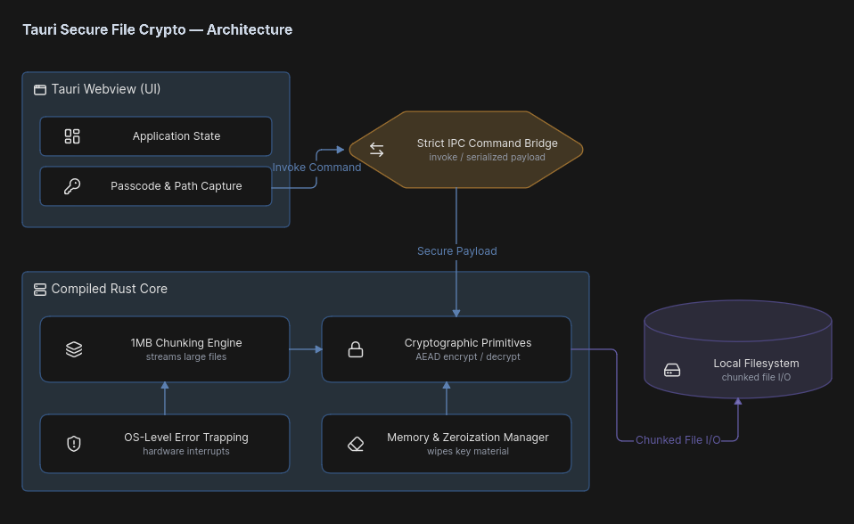

# Ombracrypt System Architecture

## 1. System Overview (Tauri & Rust Isolation)

Ombracrypt is built upon the Tauri framework, deliberately enforcing a strict architectural separation between the presentation layer and the cryptographic execution environment. This bifurcated design ensures that sensitive memory management and hardware-level operations are completely isolated from the web-based frontend.

**The Presentation Layer (Tauri Webview)**
The frontend UI is exceptionally lightweight, responsible solely for state management, visual feedback, and the initial capture of user parameters (e.g., target file paths, cryptographic profile selection, and the Master/Deception Passcodes). 

**The Cryptographic Core (Compiled Rust Binary)**
The backend is a natively compiled, high-performance Rust binary. It assumes absolute authority over all filesystem I/O, raw byte manipulation, streaming, and cryptographic execution. The Rust core operates without any external network dependencies, ensuring strict operational security and zero telemetry.

**The IPC Command Bridge**
Communication between the frontend and the backend is exclusively routed through Tauri's Inter-Process Communication (IPC) bridge. 
* Data passed through the IPC is strictly sanitized. 
* The frontend invokes the Rust backend asynchronously, passing the required passcodes and paths.
* The moment the Rust core receives the command, the frontend discards the sensitive inputs from its state. The Rust core performs the heavy lifting and returns only safe execution statuses (e.g., success metrics, chunk progression, or intercepted OS-level errors) back to the UI.

  

## 2. Memory-Safe Streaming Pipeline (v0.3.3)

Prior to version 0.3.3, Ombracrypt utilized a RAM-bound cryptographic execution model. While performant for small files, this architecture inherently limited the maximum vault size to the host system's available memory. Attempting to process payloads exceeding local hardware constraints (such as a standard 16 GB development environment) resulted in Out-of-Memory (OOM) exceptions.

The v0.3.3 release introduces a complete architectural overhaul via a deterministic, disk-streaming pipeline:

* **On-the-Fly Archiving:** Target directories are piped directly into a temporary `.tar` stream, eliminating the need to hold the entire uncompressed dataset in active memory.
* **1MB Strict Chunking:** The unencrypted stream is sequentially segmented into strict 1MB chunks.
* **Continuous Execution:** The Rust Cryptographic Engine processes and flushes each 1MB chunk through the selected AEAD cipher (AES-256-GCM or XChaCha20) directly to the `.obv` output file on the disk. 

This read-encrypt-write cycle guarantees a near-zero memory footprint, enabling the encryption of theoretically limitless payloads regardless of the host machine's RAM capacity.

## 3. OS-Level Error Trapping & Failsafes

To maintain data integrity during extended I/O operations, the Rust core implements strict, OS-level hardware interrupt handling to prevent vault corruption.

* **Storage Exhaustion Interception:** If the local filesystem reaches maximum capacity during the chunked write process, the engine intercepts the OS-level "disk full" panic before a hard crash occurs.
* **Secure Rollback:** Upon an intercepted hardware failure, the engine initiates an automated rollback protocol. It aggressively unlinks and deletes the partially constructed `.obv` and `.obk` files to prevent the existence of corrupted, unrecoverable vaults.
* **Anomaly Tolerance:** The file ingestion pipeline natively bypasses structural anomalies—including zero-byte directories, deeply nested paths, and strict filesystem permission walls—logging the skipped asset without halting the primary encryption thread.

## 4. Application State & Cryptographic Zeroization

Cryptographic key material must never persist in system memory longer than strictly required for active execution.

* **Frontend State Drop:** The Tauri Webview instantly drops the Master Password and Deception Passcode from its internal state the millisecond the IPC command resolves.
* **Backend Memory Wiping:** The Rust `Memory & Zeroization Manager` forces a secure wipe of $K_{Master}$, intermediate KDF keys, and derived hashes from the host machine's active RAM immediately upon the completion, abortion, or failure of the cryptographic process.